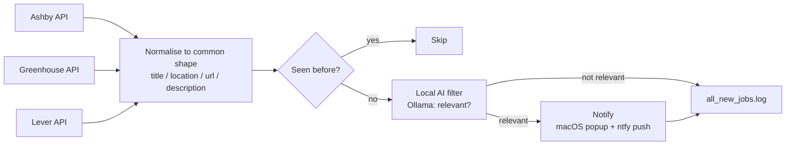

# Job Alert

A self-hosted watcher for company career pages. It polls each configured
company's job board, detects newly posted roles in near-real-time, filters
them for relevance with a locally-run AI model, and delivers a macOS
notification and an Android push for anything worth knowing about.

Every external service it depends on is free and keyless: the Ashby,
Greenhouse, and Lever job-board APIs; [ntfy.sh](https://ntfy.sh) for phone
push; and [Ollama](https://ollama.com) for on-device AI filtering. There are
no accounts to create and no per-call costs.

## How it works



On each run the script fetches the current openings for every company in
`COMPANIES`, compares them against the roles it has already seen
(`seen_jobs.json`), and for each new posting asks a local Ollama model
whether it matches a configured candidate profile. Relevant postings trigger
a macOS notification and an Android push simultaneously. Every new posting —
relevant or not — is also appended to `all_new_jobs.log`, giving a complete,
permanent record independent of the notifications.

Each hiring platform returns data in a different shape, so the script uses
one small adapter per platform (`fetch_ashby_jobs`, `fetch_greenhouse_jobs`,
`fetch_lever_jobs`) that normalises everything into a single common shape.
The filtering, notification, and logging stages are platform-agnostic, which
makes supporting a new company a one-line addition when it runs on a platform
that is already supported.

## Requirements

- Python 3.9+
- [Ollama](https://ollama.com) running locally with a model pulled
- macOS (for the native notification; the ntfy push works anywhere)
- The [ntfy](https://ntfy.sh) app on the target phone

## Setup

1. Install the dependencies:
   ```
   pip install -r requirements.txt
   ```

2. Ensure Ollama is running with a model available:
   ```
   ollama list                       # if empty, pull the default model:
   ollama pull qwen2.5:7b-instruct
   ```

3. Configure the ntfy topic. It is treated as a secret and kept out of
   source control:
   ```
   cp .env.example .env
   ```
   Set `NTFY_TOPIC` in `.env` to a unique, hard-to-guess string, then
   subscribe to that exact topic in the ntfy app. Anyone who knows the topic
   can push to the subscribed device, which is why `.env` is gitignored.

4. Edit the configuration block in `job_alert.py`:
   - `OLLAMA_MODEL` — match a model name from `ollama list`.
   - `PROFILE_DESCRIPTION` — describe the roles that should trigger an alert.
   - `COMPANIES` — the companies to watch. See
     [ADDING_COMPANIES.md](ADDING_COMPANIES.md) for how to find a company's
     platform and board ID.

5. Run it manually to confirm the configuration:
   ```
   python3 job_alert.py
   ```

6. Schedule it to run automatically. See
   [launchd_setup.md](launchd_setup.md) for running it every few minutes on
   macOS via `launchd`.

## Tests

The adapters separate parsing from network I/O, so they can be tested offline
against representative API payloads:

```
pip install pytest
pytest
```

The tests verify that Ashby, Greenhouse, and Lever responses all normalise
into the same `{title, location, url, description}` shape, and that edge
cases such as a `null` location do not break the pipeline.

## Project layout

| Path | Purpose |
|---|---|
| `job_alert.py` | The pipeline: fetch, dedupe, filter, notify, log |
| `requirements.txt` | Python dependencies (`requests`, `python-dotenv`) |
| `.env.example` | Template for the `NTFY_TOPIC` secret |
| `tests/` | Offline tests for the platform adapters |
| `ADDING_COMPANIES.md` | How to add a company to track |
| `launchd_setup.md` | How to schedule the script on macOS |
| `LICENSE` | MIT |

## Design notes

- **Polling, not push.** These platforms expose no public webhooks, so
  "near-real-time" means checking on a timer rather than receiving instant
  push from the source.
- **The AI filter fails open.** If Ollama is unreachable, postings are
  treated as relevant rather than dropped — a missed opportunity is worse
  than one extra notification.
- **`all_new_jobs.log` is the ground truth.** Every new posting is logged
  there regardless of the filter outcome, as a safety net against a missed
  notification.

## License

MIT — see [LICENSE](LICENSE).
