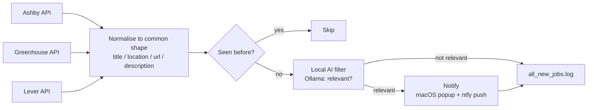

# Job Alert

A self-hosted watcher for company career pages. It checks each company's job
board on a timer, spots newly posted roles, runs them through a local AI model
to judge relevance, and sends a macOS notification plus an Android push when
something worth seeing shows up.

Everything it relies on is free and needs no API key. It uses the public
Ashby, Greenhouse, and Lever job-board APIs, [ntfy.sh](https://ntfy.sh) for
phone notifications, and [Ollama](https://ollama.com) for the local AI
filtering. No accounts, no per-call costs.

## How it works



Each time it runs, the script pulls the current openings for every company in
`COMPANIES` and compares them against the roles it has already seen (stored in
`seen_jobs.json`). For anything new, it asks a local Ollama model whether the
posting fits a candidate profile you configure. If it does, you get a macOS
notification and an Android push at the same time. Either way, every new
posting is appended to `all_new_jobs.log`, so there is always a full record
even if you miss an alert.

Different platforms return job data in different shapes, so each one has its
own small adapter (`fetch_ashby_jobs`, `fetch_greenhouse_jobs`,
`fetch_lever_jobs`) that converts the response into a single common format.
Everything after that point (filtering, notifying, logging) works the same
regardless of source, so adding a company on an already supported platform is
usually a one-line change.

## Requirements

- Python 3.9+
- [Ollama](https://ollama.com) running locally with a model pulled
- macOS for the native notification (the ntfy push works on any platform)
- The [ntfy](https://ntfy.sh) app installed on your phone

## Setup

1. Install the dependencies:
   ```
   pip install -r requirements.txt
   ```

2. Make sure Ollama is running with a model available:
   ```
   ollama list                       # if empty, pull the default model:
   ollama pull qwen2.5:7b-instruct
   ```

3. Set up the ntfy topic. It is treated as a secret and kept out of source
   control:
   ```
   cp .env.example .env
   ```
   Set `NTFY_TOPIC` in `.env` to a unique, hard to guess string, then
   subscribe to that exact topic in the ntfy app. Anyone who knows the topic
   can push to the subscribed device, which is why `.env` is gitignored.

4. Edit the configuration block in `job_alert.py`:
   - `OLLAMA_MODEL`: match a model name from `ollama list`.
   - `PROFILE_DESCRIPTION`: describe the roles that should trigger an alert.
   - `COMPANIES`: the companies to watch. See
     [ADDING_COMPANIES.md](ADDING_COMPANIES.md) for how to find a company's
     platform and board ID.

5. Run it once by hand to check the configuration:
   ```
   python3 job_alert.py
   ```

6. Schedule it to run on its own. See [launchd_setup.md](launchd_setup.md) for
   running it every few minutes on macOS via `launchd`.

## Tests

The adapters keep parsing separate from network calls, so they can be tested
offline against sample API payloads:

```
pip install pytest
pytest
```

The tests check that Ashby, Greenhouse, and Lever responses all turn into the
same `{title, location, url, description}` shape, and that edge cases like a
`null` location do not break the pipeline.

## Project layout

| Path | Purpose |
|---|---|
| `job_alert.py` | The pipeline: fetch, dedupe, filter, notify, log |
| `requirements.txt` | Python dependencies (`requests`, `python-dotenv`) |
| `.env.example` | Template for the `NTFY_TOPIC` secret |
| `tests/` | Offline tests for the platform adapters |
| `ADDING_COMPANIES.md` | How to add a company to track |
| `launchd_setup.md` | How to schedule the script on macOS |
| `LICENSE` | MIT |

## Design notes

- **Polling, not push.** These platforms don't offer public webhooks, so
  "real time" here means checking on a short timer instead of getting an
  instant push from the source.
- **The AI filter fails open.** If Ollama isn't reachable, postings are
  treated as relevant instead of being dropped. Missing a real opportunity is
  worse than getting one extra notification.
- **`all_new_jobs.log` is the source of truth.** Every new posting lands there
  no matter what the filter decides, as a safety net in case you miss a
  notification.

## License

MIT. See [LICENSE](LICENSE).
